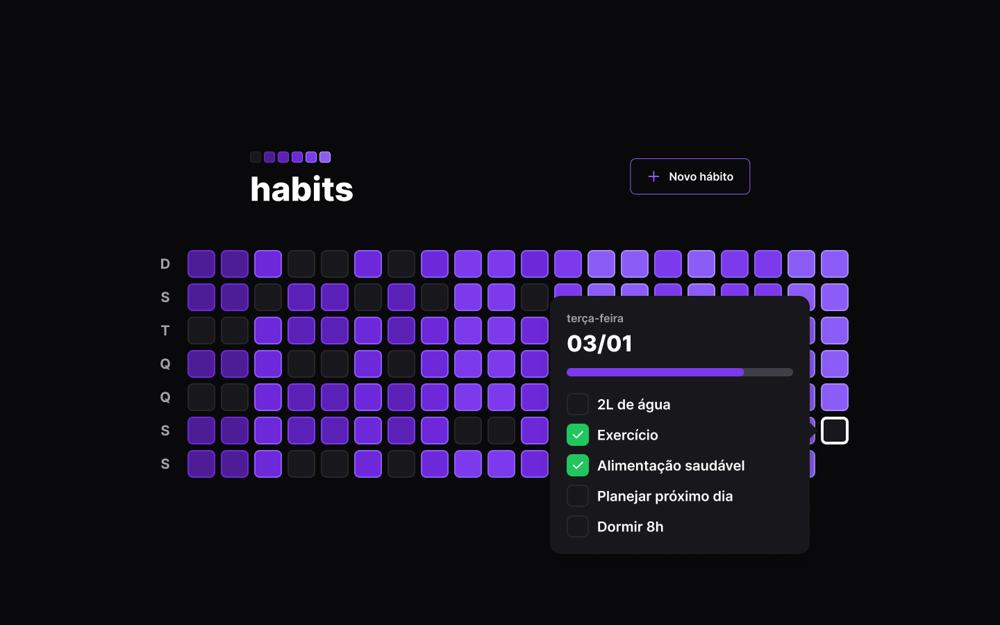

<h1 align="center"> Frontend Web App Habits </h1>

<p align="center">
  <a href="#-tecnologias">Tecnologias</a>&nbsp;&nbsp;&nbsp;|&nbsp;&nbsp;&nbsp;
  <a href="#-projeto">Projeto</a>&nbsp;&nbsp;&nbsp;|&nbsp;&nbsp;&nbsp;
  <a href="#-layout">Iniciando Projeto</a>&nbsp;&nbsp;&nbsp;|&nbsp;&nbsp;&nbsp;
  <a href="#memo-licença">Licença</a>
</p>

<p align="center">
  
</p>

## 🚀 Tecnologias

Esse projeto foi desenvolvido com as seguintes tecnologias:

- Typescript
- Javascript
- React
- Vite
- HTML e CSS
- Tailwind
- Figma
- Git e GitHub

## 💻 Projeto

Esse projeto é uma parte de três, foi desenvolvido o frontend web de uma app de criação e rastreamento de hábitos. Foi criado um sumario gerando todos os dias do ano, componentes de criação, modificação de estado e visualização dos hábitos feitos ou há fazer nos dias.

## 🔖 Iniciando Projeto

```
npm run dev
```

## :memo: Licença

Esse projeto está sob a licença MIT.

---

Feito by Emerson Dantas in NLW Setup feat Rocketseat
